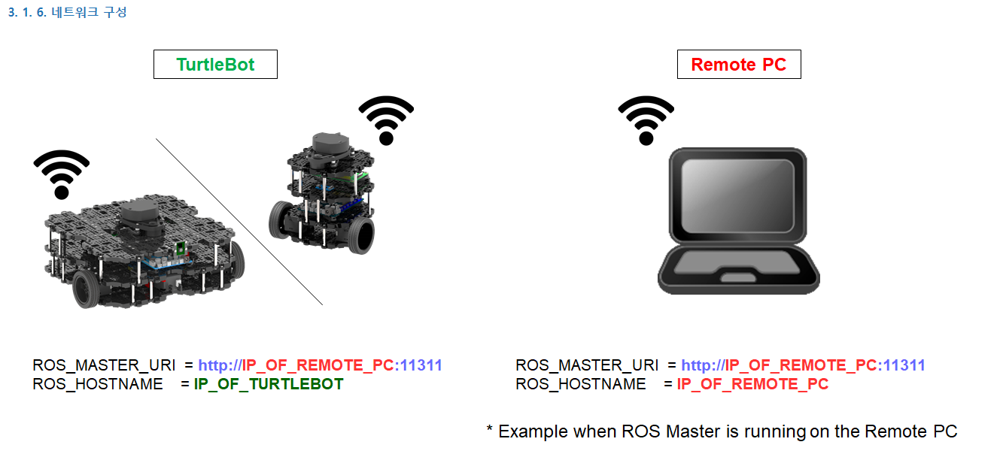

# 설정기기 셋팅

## [PC 설정](https://emanual.robotis.com/docs/en/platform/turtlebot3/quick-start/#pc-setup)
* 16.04.5의 버전의 ubuntu를 다운로드및 설치를 진행해준다.
```
$ sudo apt-get update
$ sudo apt-get upgrade
$ wget https://raw.githubusercontent.com/ROBOTIS-GIT/robotis_tools/master/install_ros_kinetic.sh
$ chmod 755 ./install_ros_kinetic.sh 
$ bash ./install_ros_kinetic.sh
```

* 종속 ROS 패키지 설치
```
$ sudo apt-get install ros-kinetic-joy ros-kinetic-teleop-twist-joy \
  ros-kinetic-teleop-twist-keyboard ros-kinetic-laser-proc \
  ros-kinetic-rgbd-launch ros-kinetic-depthimage-to-laserscan \
  ros-kinetic-rosserial-arduino ros-kinetic-rosserial-python \
  ros-kinetic-rosserial-server ros-kinetic-rosserial-client \
  ros-kinetic-rosserial-msgs ros-kinetic-amcl ros-kinetic-map-server \
  ros-kinetic-move-base ros-kinetic-urdf ros-kinetic-xacro \
  ros-kinetic-compressed-image-transport ros-kinetic-rqt* \
  ros-kinetic-gmapping ros-kinetic-navigation ros-kinetic-interactive-markers
```

* Turtlebot3 패키지 설치

```
$ sudo apt-get install ros-kinetic-dynamixel-sdk
$ sudo apt-get install ros-kinetic-turtlebot3-msgs
$ sudo apt-get install ros-kinetic-turtlebot3
```

* Turtlebot3 모델 이름 설정
  * turtlebot3 버거의 경우
```
$ echo "export TURTLEBOT3_MODEL=burger" >> ~/.bashrc
``` 
  * turtlebot3 와플파이의 경우
```
$ echo "export TURTLEBOT3_MODEL=waffle_pi" >> ~/.bashrc
```

* 네트워크 구성



  * PC를 Wifi 장치에 연결하고 아래 명령으로 할당된 IP 주소를 찾는다.
  ```
  $ ifconfig
  ```
  * 파일을 열고 아래 명령으로 ROS IP 설정을 업데이트 한다.
  ```
  $ nano ~/.bashrc
  ```
    * bashrc 셋팅 : 해당 주소에 맞게 변경
    ```
    export ROS_MASTER_URI=http://192.168.0.100:11311
    export ROS_HSTNAME=192.168.0.100
    ```
  * 아래 명령으로 bashrc를 소싱한다.
  ```
  $ source ~/.bashrc
  ```

## [라즈베리파이 4B 셋팅](https://emanual.robotis.com/docs/en/platform/turtlebot3/sbc_setup/#sbc-setup)
* 라즈베리 파이 부팅
  * 모니터의 hdmi 케이블을 Raspberry pi와 연결을한다.
  * 입력장치, microSD 카드를 삽입하고, 전원을 연결하여 Raspberry Pi를 킨다.
  * 


